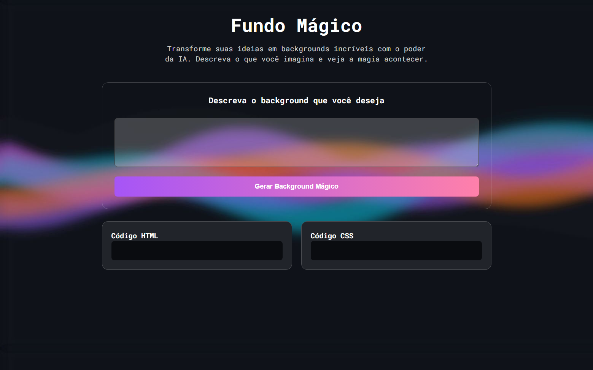

# ✨ Fundo Mágico

  

Uma aplicação web interativa que permite ao usuário **descrever um fundo mágico em texto** e receber, em tempo real, **código HTML e CSS gerados dinamicamente**, exibindo o resultado em uma área de preview com animação aplicada ao fundo da página.

Este projeto foi desenvolvido como parte da **Semana do Zero ao Programador Contratado (SZPC)**, com foco em frontend e integração com APIs.

---

## 🧠 Sobre o Projeto

O usuário digita uma descrição (prompt) de um background desejado e o sistema:

1. Envia essa descrição para uma **API criada no n8n**
2. Recebe como resposta um JSON contendo **HTML e CSS**
3. Exibe o código gerado na tela
4. Aplica o CSS dinamicamente na página
5. Renderiza o HTML em um **preview ao vivo**

Tudo isso acontece sem recarregar a página, usando JavaScript puro.

---

## 🚀 Funcionalidades

- ✍️ Envio de descrição via formulário  
- 🔄 Comunicação com API externa (n8n)  
- 🎨 Geração dinâmica de HTML e CSS  
- 👁️ Preview em tempo real do fundo gerado  
- ⚡ Atualização dinâmica do estilo da página  
- ⏳ Indicador de carregamento durante a requisição  

---

## 🛠️ Tecnologias Utilizadas

- **HTML5** – Estrutura da aplicação  
- **CSS3** – Estilização, layout e responsividade  
- **JavaScript (Vanilla)** – Manipulação do DOM e requisições HTTP  
- **n8n** – Backend/API para geração do conteúdo dinâmico  
